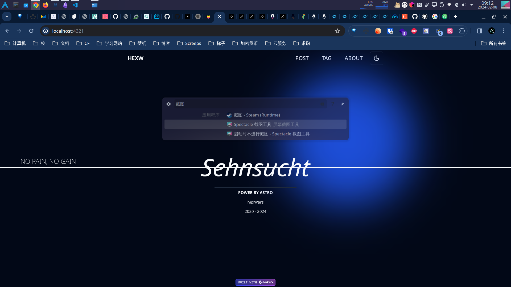

[English](./README.md) | [中文](./README-zh.md)

# Astro Theme: HEXW

> 欢迎给我建议

HEXW是一款基于Shadcn, TailwindCSS, React的Astro主题, 可以方便的构建博客网站

## 💡 特征

- [X] 首页，归档，标签页完成

TODO:

- [ ] 全局配置
- [ ] rss
- [ ] 搜索
- [ ] 响应式
- [ ] ...
  
## 🚀 开始

...

<!-- TODO: 安装指令，更多请查看demo站点 -->

## 🧞 命令

所有命令都从项目的根目录的终端运行：

| Command                   | Action                                           |
| :------------------------ | :----------------------------------------------- |
| `npm install`             | 安装依赖项                            |
| `npm run dev`             | 启动本地开发服务器 `localhost:4321`      |
| `npm run build`           | 构建您的生产站点 `./dist/`          |
| `npm run preview`         | 部署之前在本地预览您的构建    |
| `npm run astro ...`       | 运行 CLI 命令，例如 `astro add`, `astro check` |
| `npm run astro -- --help` | 使用 Astro CLI 获取帮助                     |

## 💻 预览

