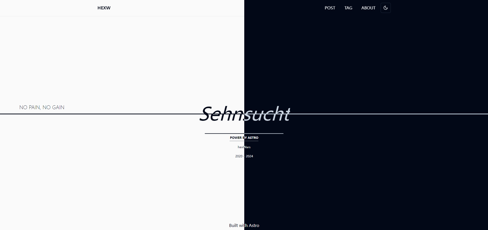
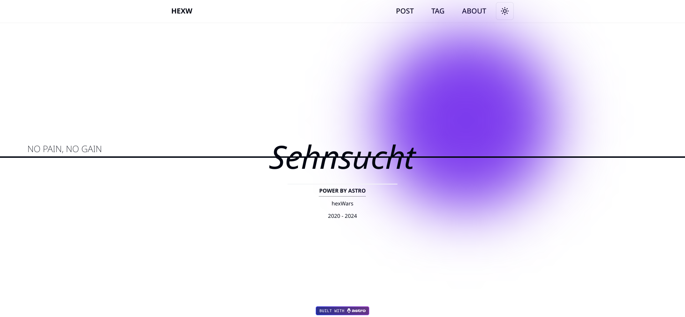
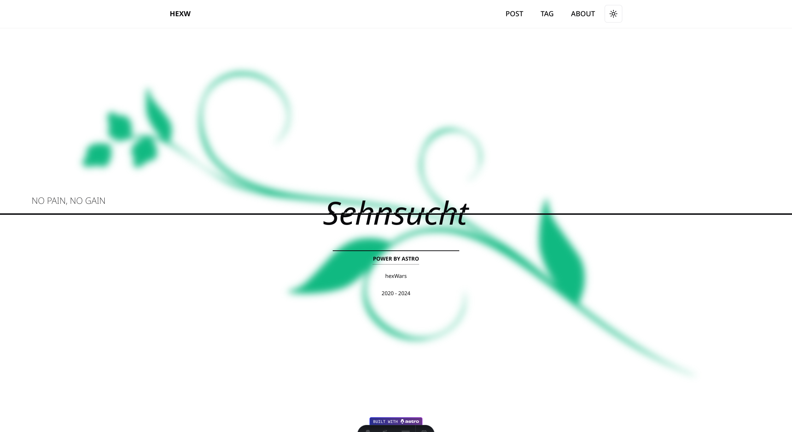

[English](./README.md) | [中文](./README-zh.md)

# Astro Theme: HEXW

> 欢迎给我建议



HEXW是一款基于Shadcn, TailwindCSS, React的Astro主题, 可以方便的构建博客网站

## 💡 特征

- [X] 首页，归档，分类，标签页完成
- [X] rss
- [X] 全局配置
- [X] 黑夜模式
  

TODO:

- [ ] 搜索
- [ ] 响应式
- [ ] 站点地图
- [ ] 社交图标
- [ ] SEO优化
- [ ] SSR
- [ ] 分页
- [ ] 时间线
- [ ] 面包屑
  
## 🚀 开始

你可以`clone`本项目后开始工作

```nodejs
npm install
```

<!-- TODO: 安装指令，更多请查看demo站点 -->

## 🧞 命令

所有命令都从项目的根目录的终端运行：

| Command                   | Action                                         |
| :------------------------ | :--------------------------------------------- |
| `npm install`             | 安装依赖项                                     |
| `npm run dev`             | 启动本地开发服务器 `localhost:4321`            |
| `npm run build`           | 构建您的生产站点 `./dist/`                     |
| `npm run preview`         | 部署之前在本地预览您的构建                     |
| `npm run astro ...`       | 运行 CLI 命令，例如 `astro add`, `astro check` |
| `npm run astro -- --help` | 使用 Astro CLI 获取帮助                        |

## 💻 预览





