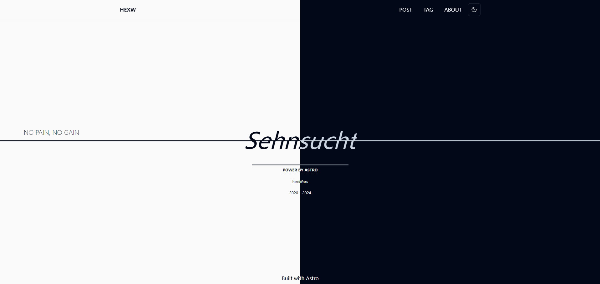
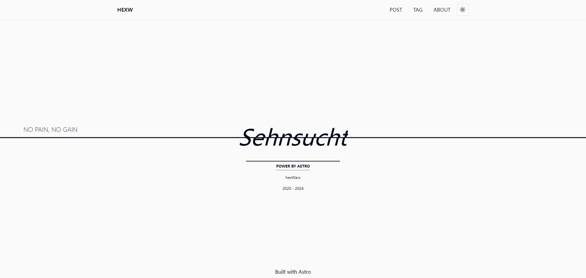
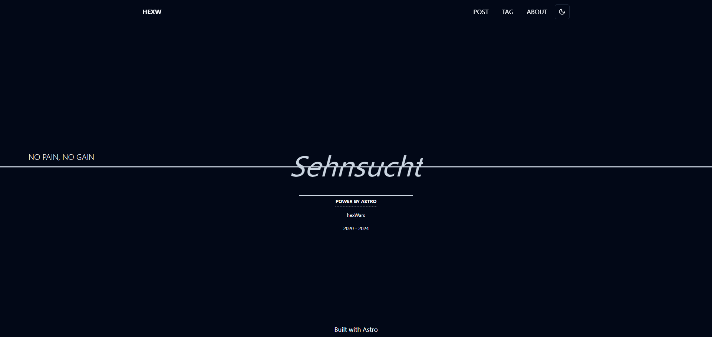
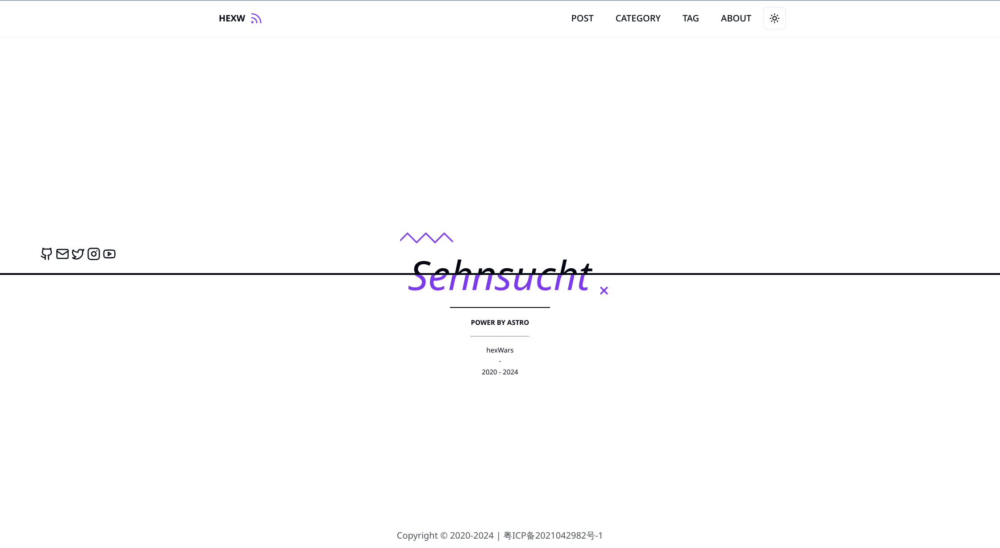
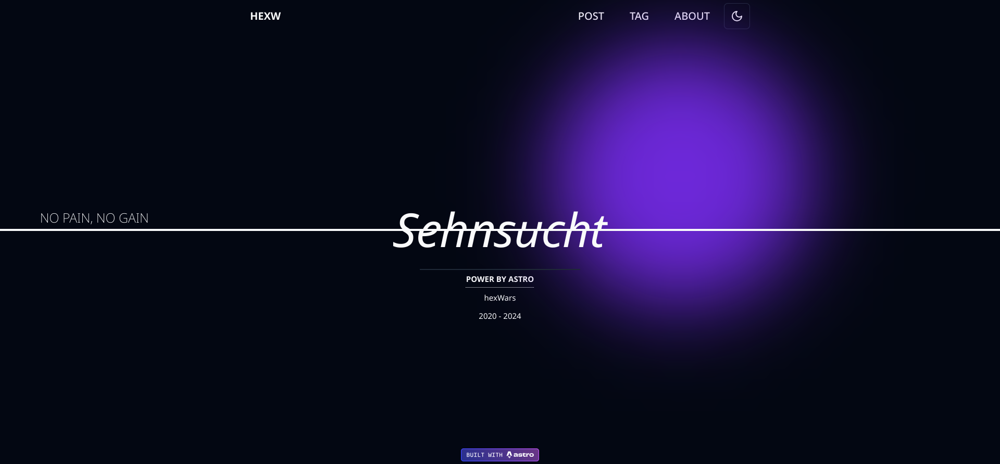
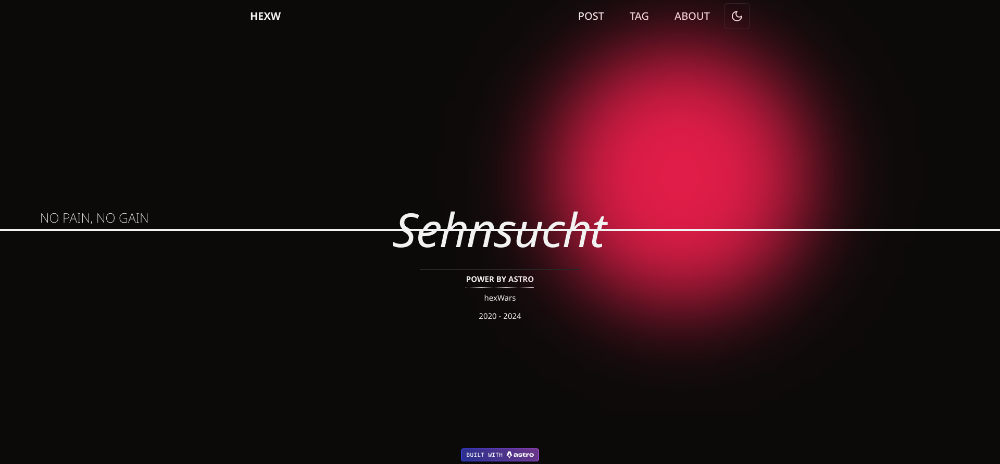
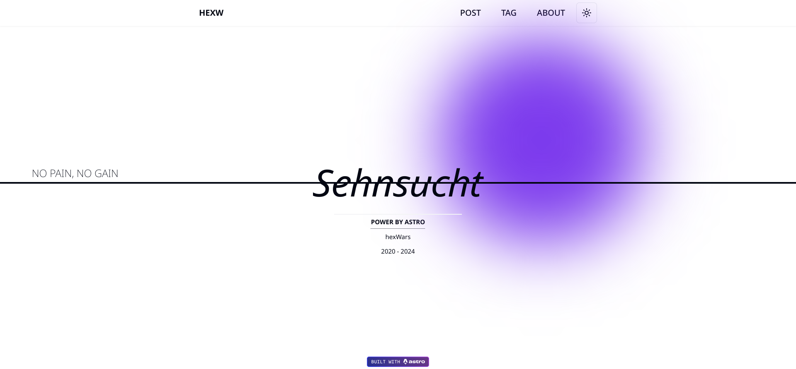
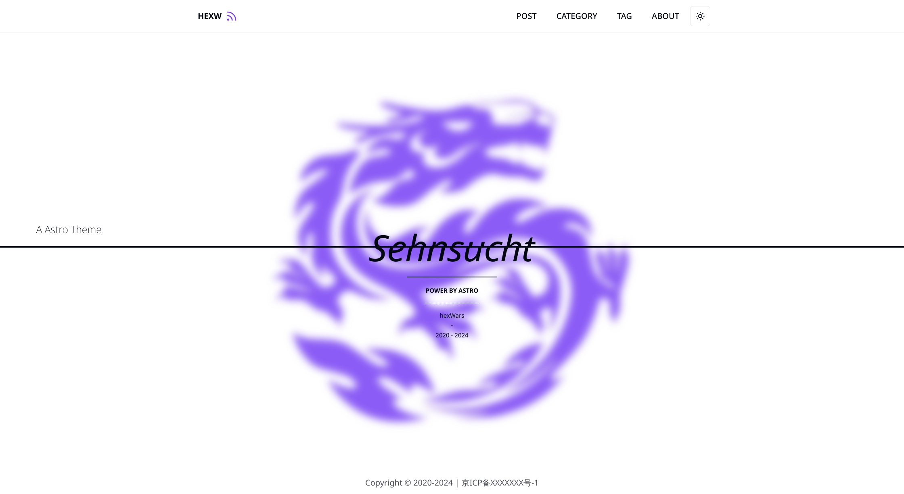
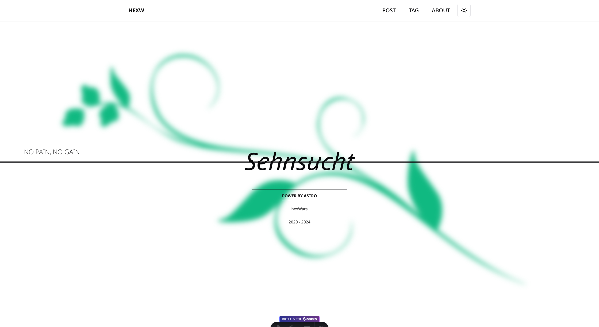

[English](./README.md) | [中文](./README-zh.md)

# Astro Theme: HEXW

> Welcome to give me suggestions.



HEXW is an Astro theme based on Shadcn, TailwindCSS, and React. It allows for easy construction of blog websites.

## 💡 Features

- [X] home, posts, articles, tags pages are completed.
- [X] rss
- [X] global config
- [X] dark mode

TODO:

- [ ] search
- [ ] responsive page
- [ ] sitemap
- [ ] socials
- [ ] SEO
- [ ] pagination
- [ ] timeline
- [ ] breadcrumb
  
## 🚀 Start

You can 'clone' this product.

```nodejs
npm install
```

<!-- TODO: 安装指令，更多请查看demo站点 -->

## 🧞 Commands

All commands are run from the root of the project, from a terminal:

| Command                   | Action                                           |
| :------------------------ | :----------------------------------------------- |
| `npm install`             | Installs dependencies                            |
| `npm run dev`             | Starts local dev server at `localhost:4321`      |
| `npm run build`           | Build your production site to `./dist/`          |
| `npm run preview`         | Preview your build locally, before deploying     |
| `npm run astro ...`       | Run CLI commands like `astro add`, `astro check` |
| `npm run astro -- --help` | Get help using the Astro CLI                     |

## 💻 Preview









