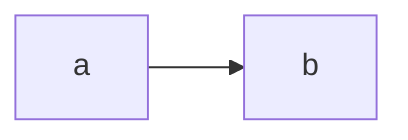
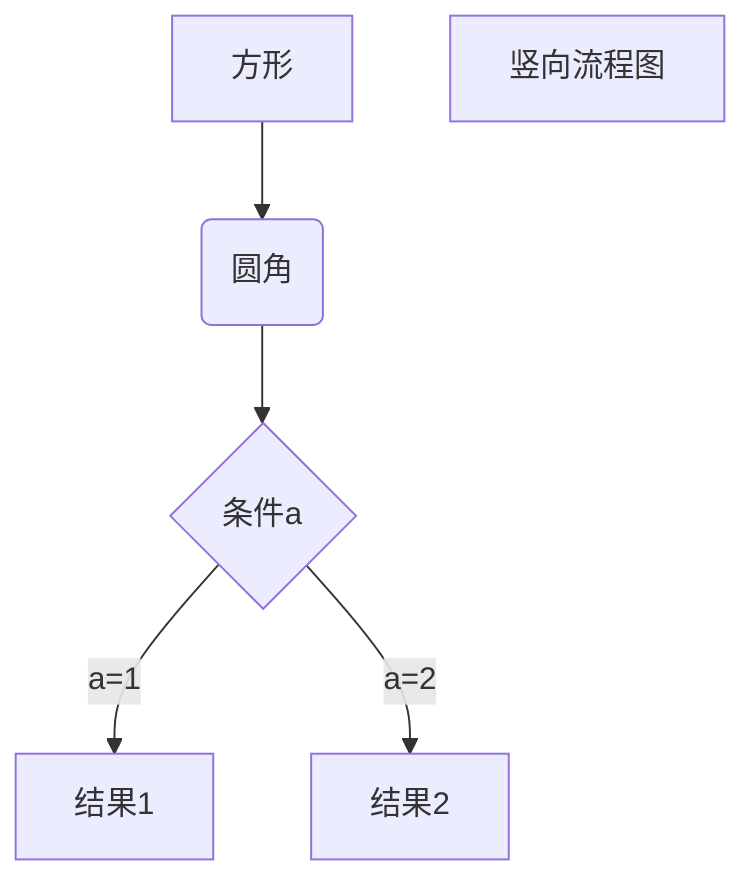

# 我的第一篇博客文章

 欢迎来**到我学习**关于 Astro 的新博客！在这里，我将分__享我建__立新网站~~的学习~~历程欢迎来到我学习关于 Astro 的新博客！在这里，我将分享我建立新网站的学习历程。欢迎来到我学习关于 Astro 的新博客！在这里，我将分享我建立新网站的学习历程。欢迎来到我学习关于 Astro 的新博客！在这里，我将分享我建立新网站的学习历程。

<a href="/">sdafdwq</a>

---

__bold text__

It`alicize`d text is the *cat's meow*.

> Dorothy followed her through many of the beautiful rooms in her castle.
>
>> The Witch bade her clean the pots and kettles and sweep the floor and keep the fire fed with wood.

1. First item
2. Second item
3. Third item
    1. Indented item
    2. Indented item
4. Fourth item

- 1968\. A great year!
- I think 1969 was second best.
  


 ## 我做了什么

1. **安装 Astro**：首先，我创建了一个新的 Astro 项目并设置好了我的在线账号。

2. **制作页面**：然后我学习了如何通过创建新的 `.astro` 文件并将它们保存在 `src/pages/` 文件夹里来制作页面。

3. **发表博客文章**：这是我的第一篇博客文章！我现在有用 Astro 编写的页面和用 Markdown 写的文章了！

4. **安装 Astro**：首先，我创建了一个新的 Astro 项目并设置好了我的在线账号。
5. **制作页面**：然后我学习了如何通过创建新的 `.astro` 文件并将它们保存在 `src/pages/` 文件夹里来制作页面。
6. **发表博客文章**：这是我的第一篇博客文章！我现在有用 Astro 编写的页面和用 [Markdown][asdf] 写的文章了！

- dfs

- fdsfw

- dsfw

- dfs
- fdsfw
- dsfw

 ### 下一步计划

 我将完成 Astro 教程，然后继续编写更多内容。关注我以获取更多信息。

 > dfid

```sql
select * from table
```



| sdfa | fwef |
| ---- | ---- |
| ffr  | fwd  |
| ffr  | fwd  |
| ffr  | fwd  |

- [ ] dsf
- [X] wefwe



### fwf

dsf


#### fwrefew
fqwefwef
df

##### rfe

ewqfdsf

###### refwsf

fweqf

[asdf]:fsf
